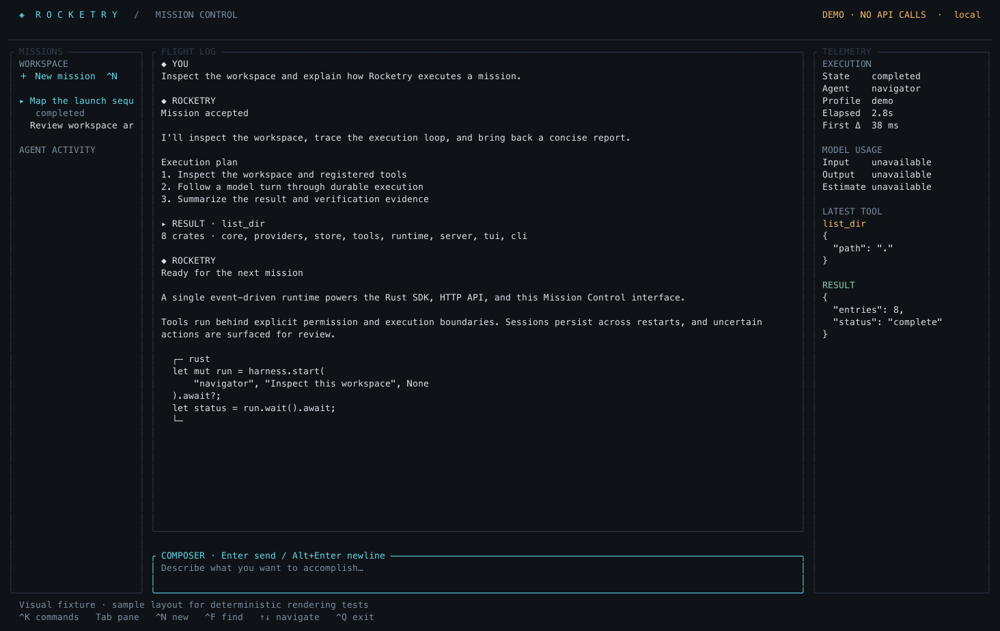

# Rocketry

A Rust agent runtime with a Mission Control terminal interface. One durable execution engine powers the Rust SDK, CLI, TUI, and authenticated REST/SSE server.



## Launch

```sh
cargo build --release -p rocketry-cli
./target/release/rocketry --demo
```

The labeled demo needs no API key. To exercise the complete model–tool loop with read-only workspace inspection, explicitly enable host execution:

```sh
./target/release/rocketry --demo --backend host
./target/release/rocketry --demo --backend host run "Inspect this workspace" --json
```

For real models, copy `rocketry.example.toml` to `rocketry.toml`, replace model placeholders, and set the referenced credential environment variables. Run `rocketry config check` and `rocketry doctor` before launching. Missing credentials never trigger a demo or provider fallback.

## What ships

- Native OpenAI Responses, Anthropic Messages, Gemini Generate Content, and OpenAI-compatible Chat Completions adapters; streaming text, tool calls, structured output, usage, and opaque continuation blocks.
- A durable model–tool loop with schema validation, bounded read concurrency, serialized workspace writes, explicit approvals, cancellation, deadlines, and shared turn budgets.
- SQLite WAL sessions, ordered events, transactional tool results, artifact storage, crash recovery, and reconciliation for uncertain external effects.
- Dynamic child agents and durable sequential/parallel/conditional workflows with joins, cached step results, and shared budgets.
- Explicit memory with namespaced SQLite full-text search and context compaction that retains the original transcript.
- File, patch, search, process, and memory tools; trusted-host and Docker execution; MCP stdio and Streamable HTTP clients.
- Responsive Mission Control TUI with sessions, agent activity, Markdown/code rendering, tool inspection, approvals, search, and local/remote operation.

## Terminal controls

| Key | Action |
| --- | --- |
| Ctrl+K | Command palette, agent/profile selection, approval review |
| Tab / Shift+Tab | Switch panes |
| Ctrl+N | New mission |
| Enter / Alt+Enter | Submit / newline |
| Ctrl+F | Search flight log |
| PgUp / PgDn | Scroll |
| Ctrl+C | Cancellation controls |
| Ctrl+Q | Exit controls |

At 140+ columns, all three panes are visible. At 100–139 columns, the inspector becomes a drawer. Smaller terminals show one pane at a time. `NO_COLOR` disables color; terminals without true-color support use a 256-color palette.

## Server and remote TUI

```sh
# Set ROCKETRY_TOKEN to a randomly generated token of at least 16 characters.
ROCKETRY_TOKEN="$(openssl rand -hex 32)" ./target/release/rocketry serve
# In another terminal, set the same ROCKETRY_TOKEN, then:
./target/release/rocketry --connect http://127.0.0.1:8787
```

The server binds to localhost by default. Every operational endpoint requires bearer authentication; `/health` is public. Server workspace tools always use Docker with isolated per-root-run directories. Reverse-proxy TLS is required if exposing the service beyond the local host. Only one process opens a database; other clients attach to its server.

The API offers sessions, messages, runs, events, SSE streams, approvals, reconciliation, workflows, and artifacts under `/v1`. Fetch `/v1/openapi.json` with authentication or run `rocketry openapi`. SSE supports `Last-Event-ID`; the TUI's remote reader uses the equivalent durable event cursor endpoint.

```sh
rocketry --demo workflow examples/workflow.json --input '"a reliable agent"'
rocketry sessions
rocketry sessions --export SESSION_ID
rocketry resume RUN_ID
rocketry --connect http://127.0.0.1:8787 cancel RUN_ID
rocketry reconcile RUN_ID --call CALL_ID --result '{"operator_verified":true}'
```

A noninteractive local run stops when approval is required; resume it interactively, or configure specific tool allowances using the policy or `--allow-tool TOOL`. There is no blanket auto-approve switch.

## Embed and extend

See [`crates/runtime/examples/sdk.rs`](crates/runtime/examples/sdk.rs) for a runnable example. Implement `ModelProvider`, `Tool`, `ExecutionBackend`, or `ApprovalPolicy` from `rocketry-core`. `SessionStore` defines the persistence contract; this release's `Harness` uses the bundled SQLite `Store` for its transactional recovery operations.

Native tool schemas are validated at startup and arguments before execution. MCP names are `mcp_<server>_<tool>`. MCP tools are external effects and require explicit policy decisions; their permissions do not come from Docker isolation.

## Verify

```sh
cargo fmt --all --check
cargo clippy --workspace --all-targets --locked -- -D warnings
cargo test --workspace --locked
cargo run --release -p rocketry-runtime --example runtime_benchmark
cargo run --release -p rocketry-tui --example tui_benchmark
python3 scripts/pty_smoke.py target/debug/rocketry
python3 scripts/http_smoke.py target/debug/rocketry
# Requires Docker:
cargo test -p rocketry-tools --test transports -- --ignored
```

See [architecture and operating limits](docs/architecture.md) and [verification evidence](docs/verification.md). Local fixture coverage does not establish live provider compatibility with every model or production load behavior.
